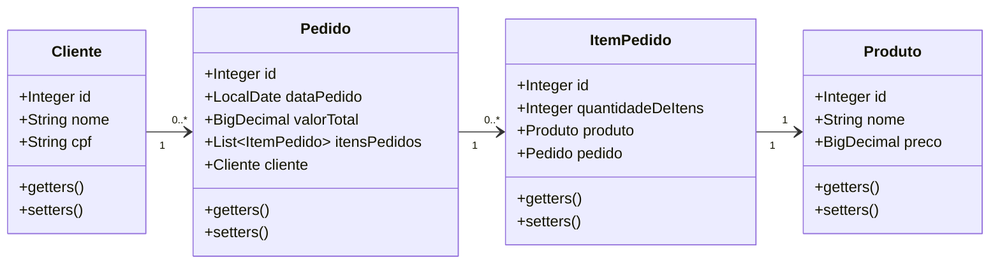

# Vendas

Uma API de Vendas desenvolvida com Spring Boot, que permite o gerenciamento de pedidos, clientes e produtos. Inclui funcionalidades para criar, listar e buscar pedidos, além de calcular o total de cada venda. A API utiliza JPA para persistência de dados, e está integrada com bancos de dados.

    <h3 align="center">Tecnologias e padrão de API utilizada</h3>
        
        
        
        
        

 

### Diagrama de Classes

